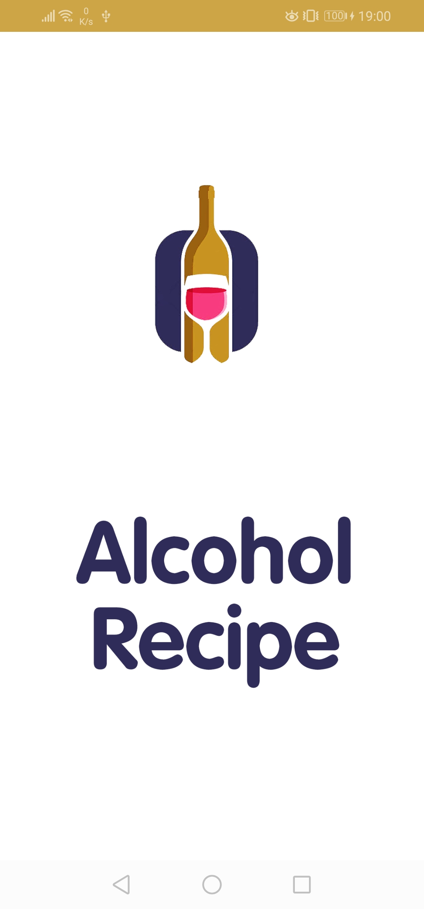
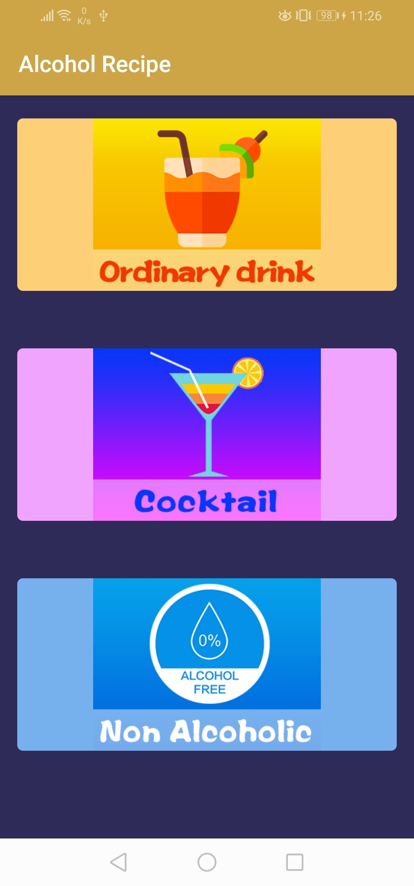
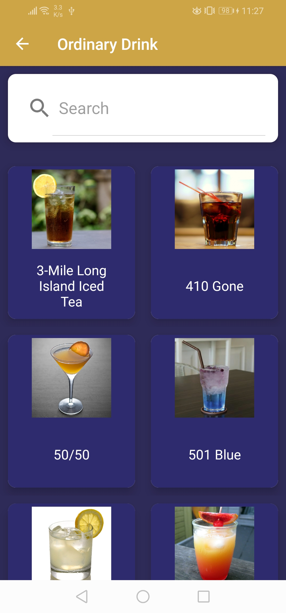
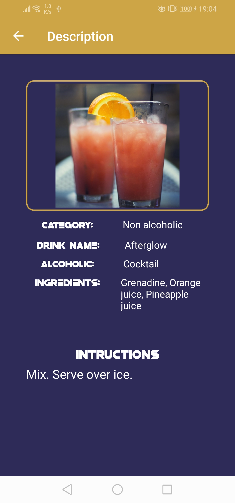

# Alcohol-Recipe

<h1>Features: </h1>

- Alcohol Recipe
- Ordinary Drink
- Non Alcoholic
- Cocktail
- Description and Instruction

<h1>Requirements: </h1>
- Internet only

<h1>API Used:</h1>

https://www.thecocktaildb.com/api.php?ref=apilist.fun

<h2>SplashScreen: </h2>

<h2>Dashboard: </h2>

<h2>Alcohol: </h2>

<h2>Description: </h2>

